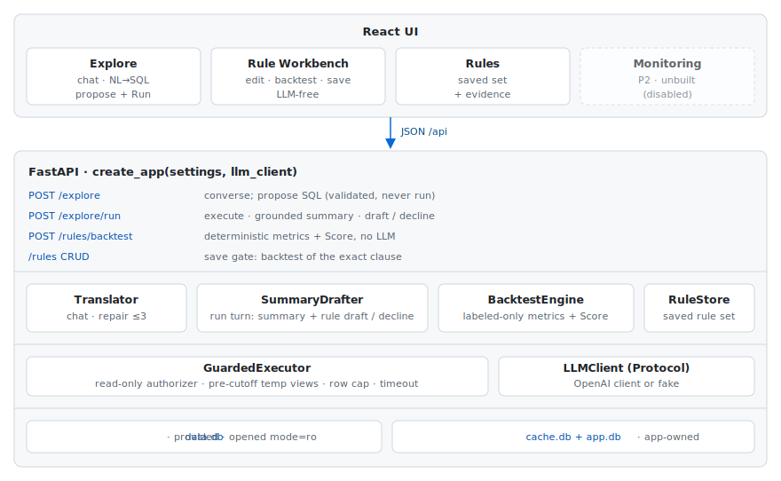

# FSM Assistant

A GenAI workbench for a Fraud Success Manager: explore 1.16M transactions in
plain English, promote a pattern to a fraud rule, and back every rule with
deterministic evidence. The LLM only ever writes SQL or prose about SQL;
every number on screen comes from executing real queries, and no rule can be
saved without a Backtest.

Product spec in [spec.md](spec.md), domain vocabulary in
[CONTEXT.md](CONTEXT.md), decision records in `docs/adr/`.

## Demo

https://github.com/user-attachments/assets/23f30399-c0c2-438c-a61c-dfb783d9d31d

## Quick start

Prerequisites: [uv](https://docs.astral.sh/uv/) and Node 20+. The provided
dataset (`data/data.db`) is checked in.

```sh
cd backend && uv sync
OPENAI_API_KEY=sk-... uv run fsm-assistant   # API on :8000; first start builds a small cache db
```

```sh
cd frontend && npm install && npm run dev    # UI on :5173, proxies /api to the backend
```

Optional env: `OPENAI_MODEL` (default `gpt-5-nano`), `FSM_PORT` (default
`8000`; start the frontend with the same value), `FSM_CUTOFF` (`2019-09-01`),
`FSM_ROW_LIMIT` (`200`), `FSM_QUERY_TIMEOUT_MS` (`5000`).

## Architecture



One date T splits the dataset (ADR-0004), shared by everything:


A rule is authored and backtested on the same pre-T slice, so its Backtest is
optimistic by construction; the UI says so, and post-T is the honest measure.

## Folder structure

```
backend/src/fsm_assistant/
  api.py              FastAPI app; create_app(settings, llm_client)
  config.py           env-driven settings
  guarded.py          GuardedExecutor: the only path to the dataset
  translator.py       Explore chat + bounded repair loop
  summary_drafter.py  run turn: grounded summary + rule draft / decline
  backtest.py         deterministic Backtest engine + 0-100 Score
  rule_store.py       saved rule set (app-owned db)
  app_db.py           app-owned databases; derived pre-T label cache
  llm.py              injectable LLM client (OpenAI / fake)
  evals/              fsm-eval: golden-set + rule-quality suites
frontend/src/
  App.tsx             tabs + masthead dataset facts
  Explore.tsx         chat, SQL proposals, run cards
  Workbench.tsx       clause editor, backtest evidence, save gate
  Rules.tsx           saved set; edit / re-backtest / delete
  evidence.tsx        Score band + evidence panel
  api.ts · handoff.ts · score.ts
```

## GenAI risk stance

- The LLM writes SQL or prose about SQL, never data; every figure on screen
  comes from executing a real query.
- Guardrails are code, not prompt: read-only SQLite authorizer, one statement
  per question, row cap, timeout, sealed post-cutoff views.
- Proposed SQL is always shown and runs only on an explicit click.
- Bounded repair: at most 3 attempts, each re-guarded; unanswerable questions
  are declined, and the evals track the refusal rate.
- Drafts translate the query's segment, never judge risk (ADR-0007); the
  deterministic Backtest is the verdict and gates saving.
- Rules cannot read `fraud_labels`, enforced by clause validation.
- No autonomous agent: the bounded repair loop is the only iteration.

## Tests

```sh
cd backend && uv run pytest   # 104 tests, offline, no key needed
```

The suite drives the HTTP API in-process with a scripted fake LLM.

## Evaluation

### Offline (built)

Both suites drive the real LLM through the same in-process HTTP seam the
tests and product use, score by execution results (never SQL strings), and
write rate reports to `backend/var/evals/*.json`. The golden set (P0) replays
14 questions through the propose-then-run path against answers derived from
known-good SQL; rule quality (P1) replays 12 known patterns through the run
turn's drafter and backtests each clause on a fixture with hand-computed
counts.

```sh
cd backend
OPENAI_API_KEY=sk-... uv run fsm-eval                    # NL→SQL golden set
OPENAI_API_KEY=sk-... uv run fsm-eval golden --runs 10   # flake measurement
OPENAI_API_KEY=sk-... uv run fsm-eval rules              # rule quality
```

Latest (gpt-4o-mini):

- **Golden set** (10 runs): 97.3% mean execution match (min 90.9%); 100%
  refusal on unanswerable questions, 0 false refusals; 0.9% shape-violation
  rate (label-join lints); mean repair depth 1.1.
- **Rule quality**: 0% false declines, the headline metric (ADR-0007); 8/8
  metric patterns match hand-computed counts; 4/4 structural patterns
  correctly decline; draft repair depth 1.0.

### Online (designed, unbuilt)

How we would prove effectiveness and safety in production:

- **Drift monitoring**: weekly live precision per saved Rule vs its Backtest
  snapshot; alert when materially below (the P2 Monitoring tab, with post-T
  standing in for live traffic).
- **Shadow mode**: new Rules tag but don't block until live precision
  supports enforcement.
- **Product metrics**: time from first question to saved Rule; share of
  drafts that survive Backtest.
- **Safety metrics**: guardrail rejection rate, repair depth distribution,
  refusal rate.

### Model yardstick (designed, unbuilt)

A seeded LightGBM classifier trained on pre-T labels, reported only in the
eval suite beside the rule set's aggregate detection (PR-AUC, recall at fixed
false-positive budgets on the post-T holdout); no product surface (ADR-0001).

## Not built (P2 outlines)

- **Monitoring tab** (ADR-0004): weekly post-T replay per saved Rule against
  its snapshot, Drift flagged; the tab renders disabled in the UI.
- **LightGBM yardstick** (ADR-0001): above.
- **Workbench polish**: instant clause preview while typing (debounced
  COUNT-shaped query) and Score presentation polish; today backtesting is an
  explicit action, which also keeps the FSM-drives-the-loop invariant.

## Design decisions

- **Guarded executor as the kernel**: one path to the data; safety is code,
  not prompt.
- **Propose, then Run** (ADR-0005): the FSM's click turns a proposal into
  evidence; no query executes without a deliberate action.
- **Draft in the run turn** (ADR-0006): the one LLM call that sees the real
  rows drafts the rule; the Workbench stays LLM-free and instant.
- **Translate, never judge** (ADR-0007): declines are structural facts about
  the query; the Backtest judges risk. False declines are the headline eval
  regression.
- **One global cutoff** (ADR-0004): pre-T visible, post-T sealed for
  monitoring and evals.
- **WHERE-shaped SQL only in the Workbench** (ADR-0003): Explore is
  chat-only; the deployable artifact is the only authorable SQL.
- **Injectable LLM client**: deterministic offline tests; model id is config.
- **Evals score denotations**: execution-result match and hand-computed
  fixtures, never SQL string comparison.
- **LightGBM as eval yardstick only** (ADR-0001): no model in the product.
